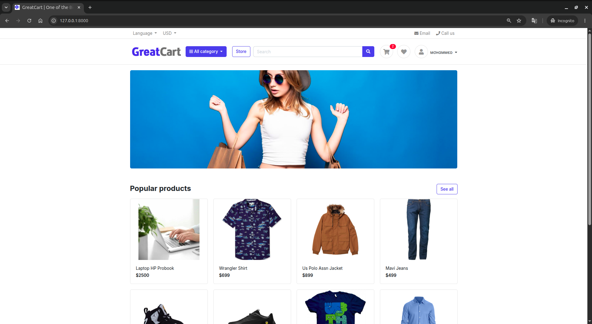
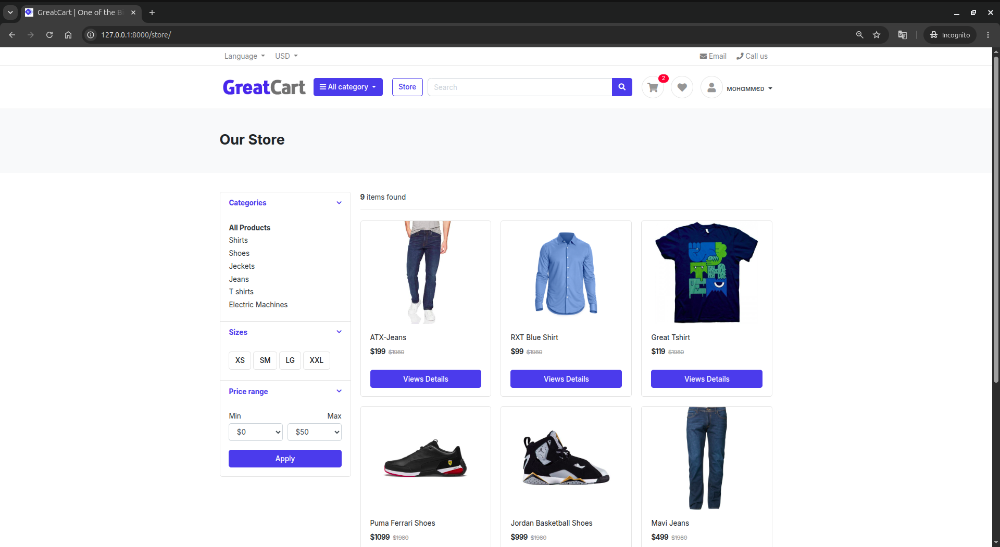
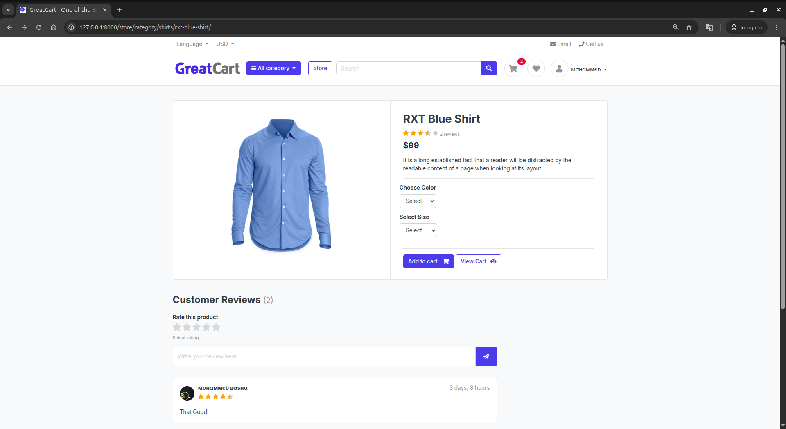
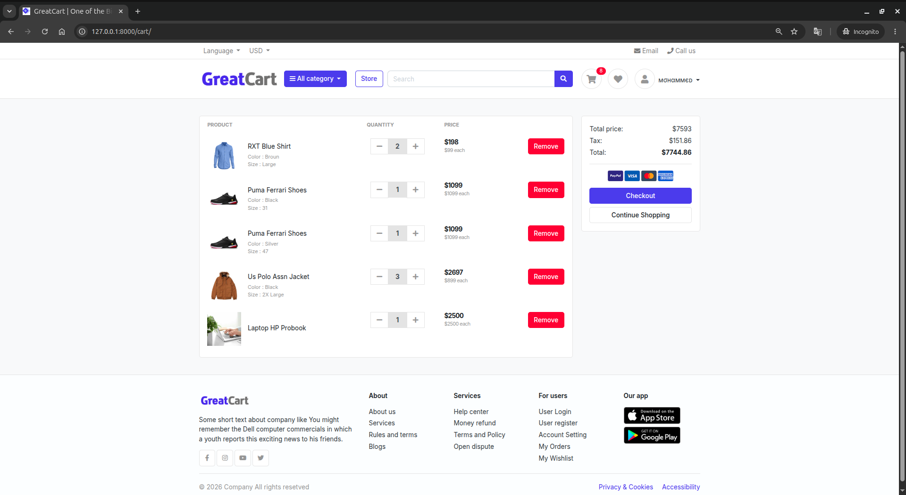
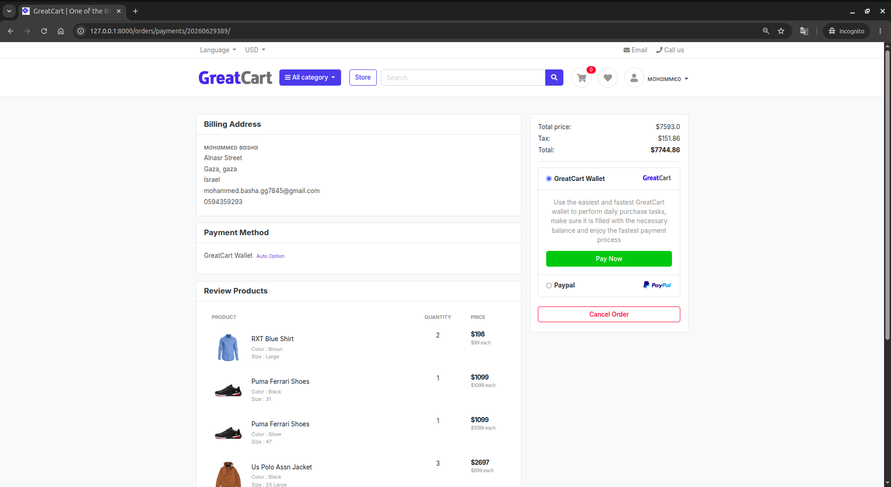
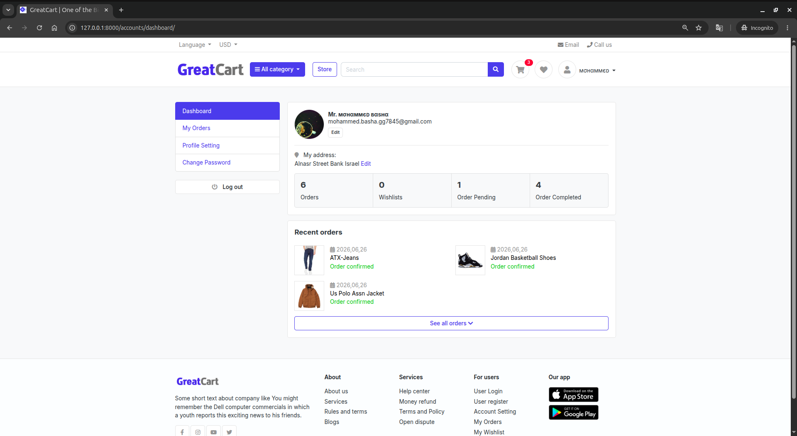
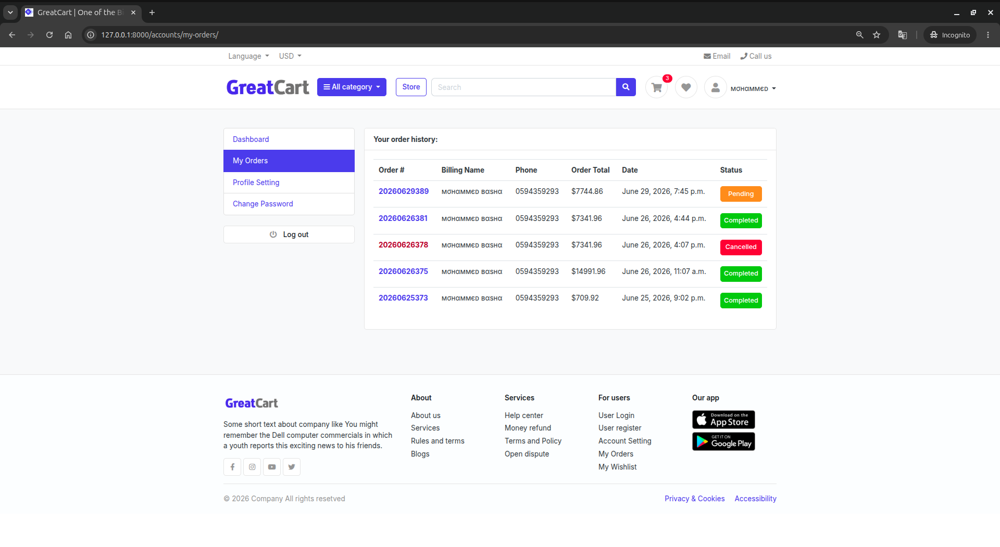
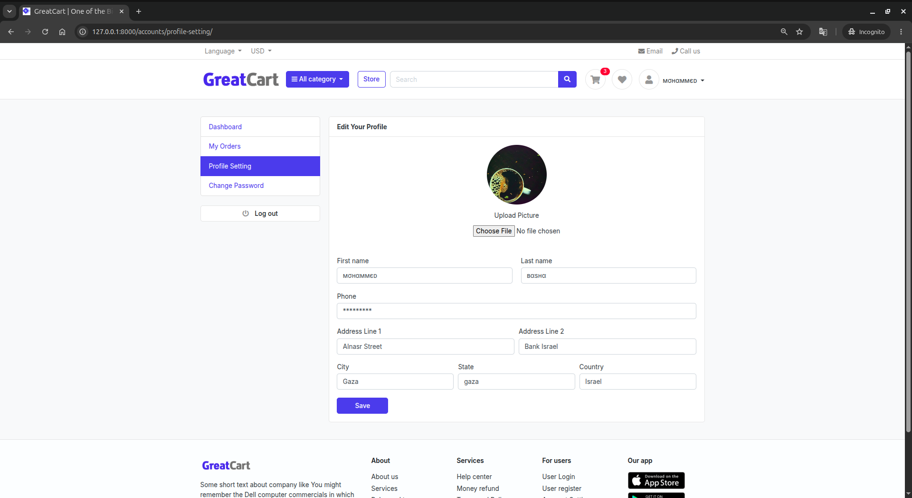

# 🛒 GreatCart

<p align="center">


</p>

A complete **E-Commerce Web Application** built with **Django**, implementing the entire shopping workflow from product browsing to order completion.

The project demonstrates how a real online store operates by combining authentication, shopping cart management, product variations, order processing, inventory control, reviews & ratings, email notifications, and a complete customer dashboard.

---

# 📸 Screenshots


## 🏠 Home



---

## 🛍 Store



---

## 📦 Product Details



---

## 🛒 Shopping Cart



---

## 💳 Checkout & Payment



---

## 👤 User Dashboard



---

## 📄 Order History



---

## ⚙ Profile Settings



---

## 🏗 System Architecture

A detailed architecture document is available here:

📄 [GreatCart System Architecture](/docs/architecture/greatcart_system_architecture.pdf)

---

# ✨ Features

## Authentication

- User Registration
- Email Verification
- Login / Logout
- Password Reset via Email
- Change Password
- Protected Views

---

## Products

- Categories
- Product Detail Page
- Product Variations
- Product Gallery
- Stock Availability

---

## Shopping Cart

- Session Cart
- Logged-in User Cart
- Automatic Cart Merge
- Quantity Management
- Remove Products
- Product Variations Support

---

## Checkout

- Billing Information
- Tax Calculation
- Order Summary

---

## Payment System

A simplified **Demo Wallet Payment Gateway** was implemented to simulate real payment processing.

Features:

- Pending Orders
- Resume Payment
- Duplicate Payment Protection
- Transaction Recording
- Payment History
- Order Completion

---

## Orders

- Order Creation
- Order Number Generation
- Move Cart → OrderProduct
- Copy Product Variations
- Stock Validation
- Stock Reduction
- Invoice Page
- Email Invoice
- Order History

---

## Reviews & Ratings

Verified Purchase Reviews

Features:

- Only purchased products can be reviewed
- One review per customer
- Review editing
- 0–5 star rating
- Average rating calculation
- Live star widget

---

## User Dashboard

- Dashboard
- Order History
- Profile Settings
- Profile Picture Upload
- Password Change
- Account Information

---

## Email Notifications

- Account Activation Email
- Password Reset Email
- Order Confirmation Email

---

# 🛠 Tech Stack

Backend

- Python
- Django

Frontend

- HTML5
- CSS3
- Bootstrap
- JavaScript
- jQuery

Database

- SQLite (Development)

Media

- Pillow

Email

- SMTP (Gmail)

---

# 📂 Project Structure

```text
GreatKart/

│
├── accounts/
├── carts/
├── category/
├── orders/
├── store/
│
├── templates/
├── static/
├── media/
│
├── greatCart/
├── manage.py
├── requirements.txt
└── .env
```

---

# ⚙ Installation

## 1. Clone Repository

```bash
git clone https://github.com/yourusername/greatCart.git

cd greatCart
```

---

## 2. Create Virtual Environment

### Windows

```bash
python -m venv venv

venv\Scripts\activate
```

### Linux / macOS

```bash
python3 -m venv venv

source venv/bin/activate
```

---

## 3. Install Requirements

```bash
pip install -r requirements.txt
```

---

## 4. Create Environment File

Create a file named

```
.env
```

Example:

```env
SECRET_KEY=your-secret-key 

EMAIL_USER=example@gmail.com

EMAIL_PASS=your-app-password
```

---

## 5. Apply Migrations

```bash
python manage.py migrate
```

---

## 6. Create Superuser

```bash
python manage.py createsuperuser
```

---

## 7. Run Development Server

```bash
python manage.py runserver
```

Open:

```
http://127.0.0.1:8000
```

---

# 🔐 Environment Variables

| Variable | Description |
|-----------|-------------|
| SECRET_KEY | Django Secret Key |
| EMAIL_USER | Email Address |
| EMAIL_PASS | Email App Password |

---

# 📧 Email Configuration

The project uses Django's SMTP backend.

For Gmail:

1. Enable Two-Factor Authentication.

2. Generate an App Password.

3. Put the generated password inside

```
EMAIL_PASS
```

---

# ⭐ Main Functionalities

✔ User Authentication

✔ Email Verification

✔ Password Reset

✔ Shopping Cart

✔ Cart Merge

✔ Product Variations

✔ Product Gallery

✔ Checkout

✔ Demo Payment Gateway

✔ Pending Orders

✔ Order Resume

✔ Inventory Management

✔ Order History

✔ Email Invoice

✔ Verified Reviews

✔ Ratings System

✔ User Dashboard

✔ Profile Settings

✔ Password Change

---

# 🚀 Future Improvements

The current version is intentionally designed to remain simple while following good development practices.

Possible future improvements include:

- Real Payment Gateway (Stripe / PayPal)
- Wishlist
- Coupon System
- Product Search Enhancements
- Pagination Improvements
- Admin Analytics Dashboard
- REST API (Django REST Framework)
- Docker Support
- PostgreSQL Production Configuration
- Redis Cache
- Unit Testing
- Deployment (Nginx + Gunicorn)

---

# 🎯 Learning Objectives

This project demonstrates practical implementation of:

- Django Authentication
- Class-Based Views
- Function-Based Views
- Model Relationships
- Forms & Validation
- Sessions
- File Uploads
- Email Services
- ORM Queries
- Order Processing
- Inventory Management
- Template Inheritance
- Static & Media Files
- Secure User Workflows

---

# 📄 License

This project is released under the MIT License.

Feel free to use it for learning, personal projects, or further development.

---

# 👨‍💻 Author

Developed as a complete Django E-Commerce learning project.

If you found this project useful, consider giving it a ⭐ on GitHub.